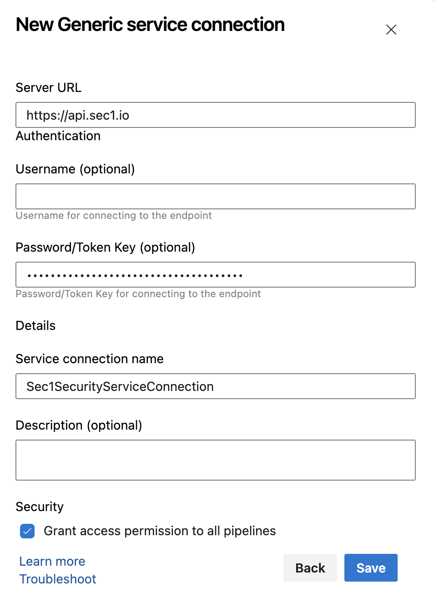
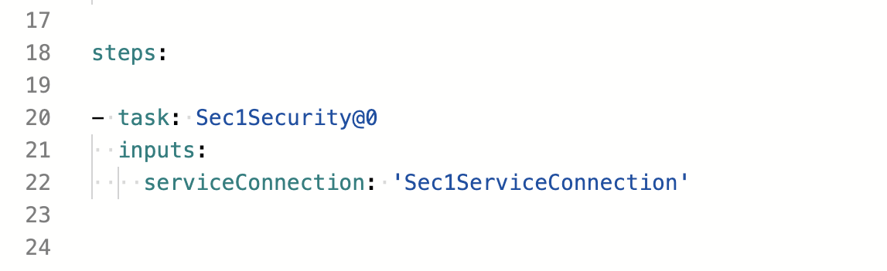

# Azure DevOps Extension

  
   
  Sec1 Security Azure DevOps Extension Version 1.0.0

## Introduction

Integrating the Sec1 Security plugin as Azure DevOps Extension allows developers and teams to enhance the security of their software projects by scanning Source Code Management (SCM) repositories for open-source vulnerabilities against the Sec1 Security Database. This documentation provides a step-by-step guide on integrating the Sec1 Security Extension into your Azure CI/CD pipelines.

## Integration Steps

1. [Install the Sec1 Security Extension](#1-install-the-sec1-security-plugin)
2. [Configure an Sec1 Security API Token](#2-configure-an-scm-access-token)
3. [Configure Sec1 Security as a Build Step](#3-configure-sec1-security-as-a-build-step)
4. [Configuration Parameters](#4-configuration-parameters)
   
## 1. Install the Sec1 Security Plugin

- Go to Azure DevOps Marketplace (https://marketplace.visualstudio.com).
- Search for "Sec1 Security" and click on the search result to visit the plugin page.
- Click on "Get it free", select the "Azure DevOps organization" where you would like to install and click "Install".
- Once installation is complete then "Proceed to organisation"

## 2. Configure an Sec1 Security API Token

  You need to configure API Token as Generic Service Connection
  
- Go to your "Project" > "Project Settings"
- Click "Service Connections" under Pipelines section
- Click "New service connection"
- Search for "Generic" and click "Next"
- Enter below configuration
  - Server URL - Default value of Server URL will be https://api.sec1.io. If you are using SaaS service then leave it blank otherwise provide the appropriate value
  - Username is optional as Sec1 Security uses API Token for authentication purpose.
  - Password/Token Key - Provide SecAPI Security API Token.
  - Service connection name - Provide appropriate service connection name (e.g. Sec1SecurityServiceConnection).
  - Description - It is option field but you can provide appropriate description.

  <b>Note</b> : To get `SecAPI Security API Token` navigate to [Scopy](https://scopy.sec1.io/) > "Login with GitHub" > "Settings"
  In the "API key" section, click on "Generate API key" and copy it for use.

<blockquote>

📷 Show Preview

</blockquote>

## 3. Configure Sec1 Security Extension as a Build Step

- Navigate to "Pipelines" section in your project.
- Click on "Edit".
- Search "Sec1 Security" in the tasks search box and select the result.
- Select Service Connection which you have added as Generic Service Connection in dropdown.
- Click "Add"

<blockquote>

📷 Show Preview

</blockquote>

## 4. Configuration Parameters

### Configure the following parameters in the "Sec1 Settings" section:

  * `Apply Threshold` (<b>optional</b>) If selected, define your vulnerability threshold levels by "Severity". Default values for Critical and High are 0 and 10 respectively   
    
    * If you set the critical vulnerability threshold to 10, your build will fail if more than 10 critical vulnerabilities are found in the scan.
    * Choose actions for the breach: Fail or Continue.

## Troubleshooting

To see more information on your steps:

- View the "Console Output" for a specific build.

---

-- Sec1 Security team